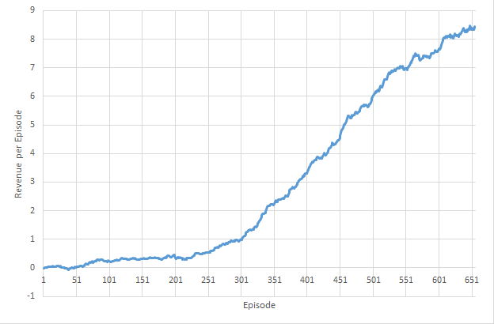

# Stock Trading OpenAI Gym Environment with Deep Reinforcement Learning

## Overview

This project provides a general environment for stock market trading simulation using [OpenAI Gym](https://gym.openai.com/). 
Training data is a close price of each day, which is downloaded from Google Finance, but you can apply any data if you want.
Also, it contains simple Deep Q-learning and Policy Gradient from [Karpathy's post](http://karpathy.github.io/2016/05/31/rl/).

In fact, the purpose of this project is not only providing a best RL solution for stock trading, but also building a general open environment for further research.  

## Requirements

- Python2.7 or higher
- Numpy
- HDF5
- Keras with Beckend (Theano or/and Tensorflow)
- OpenAI Gym

## Usage

Note that the most sample training data in this repo is from Chinese stocks. 
You need to re-download your own training data depending on your problem.

If all the above requirements are satisfied you can begin training both the algorithms, Deep Q-learning and Policy Gradient.

Train Deep Q-learning:

    $ python market_dqn.py <list filename> [model filename]

Train Policy Gradient:

	$ python market_pg.py <list filename> [model filename]

For example, you can do:

	$ python market_pg.py ./kospi_10.csv pg.h5

Please note that the provided neural network architecture in this repo is too small to learn.
So, it may under-fit if you try to learn al stock data.
It's just fitted for 10-100 stocks worth of data for a few years.This was the first project before I worked on the propreitary version for the fund I'm working with.  
Thus you need to re-design your own architecture! Have fun with this one, and   
**let me know if you have better one!**

Below is training curve for Top-10 SSE stock datas for 4 years using Policy Gradient. Clearly you need to train more!!

## To do
- Test environment to check overfitting.
- Elaborate the PG's train interface.

## Reference

[1] [Playing Atari with Deep Reinforcement Learning](http://arxiv.org/abs/1312.5602)  
[2] [Deep Reinforcement Learning: Pong from Pixels](http://karpathy.github.io/2016/05/31/rl/)  
[3] [Keras Reinforcement Learning gYM agents, KeRLym](https://github.com/osh/kerlym)  
[4] [Keras plays catch, a single file Reinforcement Learning example](http://edersantana.github.io/articles/keras_rl/)
